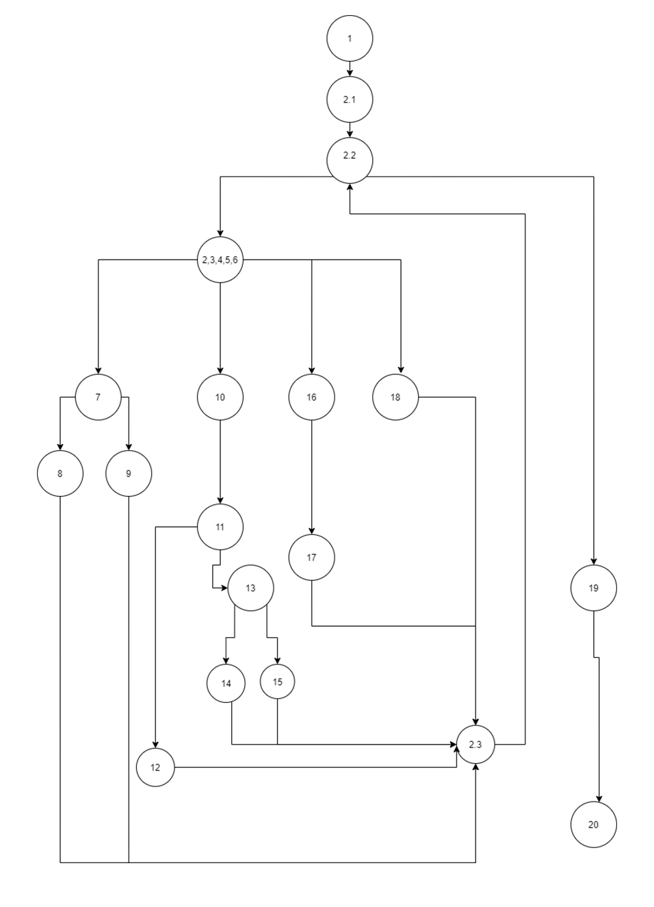

Втора лабораториска вежба по Софтверско инженерство

Бојан Крстевски 193248

Изглед на Control Flow Graph

Цикломатската комплексност на овој код е 8, ја добив со (формулата број на предикати + 1), тука P=7, така што
P+1=8

Multiple Condition тест случаи:

if (hr<0 || hr>24)	 
-30, X 
1, 30 
3, 13 

if (min<0 || min>59) 
-30, X 
1, 70 
3, 13 

if (sec>=0 && sec<=59) 
30, X 
-3, 70 
-3, 13 

else if (hr==24 && min==0 && sec==0) 
24, 0, 0	 
24, 0, 3	 
24, 3, X	 
25, X, X 

Every Branch тест случаи  
null 
h=-1, m=X, s=X	 
h=25, m=X, s=X	 
h=1, m=-1, s=X	 
h=1, m=1, s=1	 
h=24, m=1, s=60	 
h=24, m=0, s=0	 
h=24, m=0, s=1	 
 
Објаснување на напишаните unit tests:
Со MultipleCondition тестовите ја тестираме секоја можна варијанта на if условите.
А, кај EveryBranch критериумот, го тестираме секое можно гранење во кодот.
Методите:
assertThrows за проверка дали настанатиот исклучок е RuntimeException,
assertEquals за проверка дали пораката при исклучокот е истата барана порака што ни треба,
assertEquals за проверка дали времето што се враќа е во ред, се споредува со листа која содржи време што треба да се провери.

